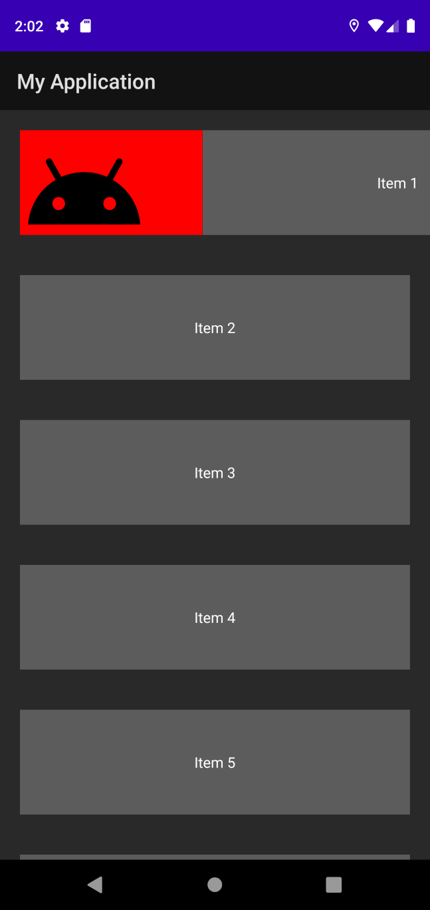
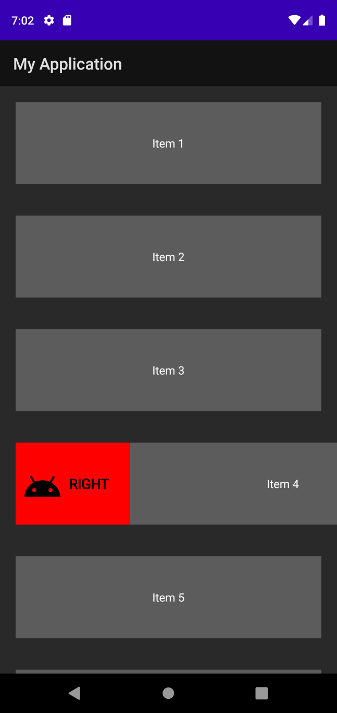
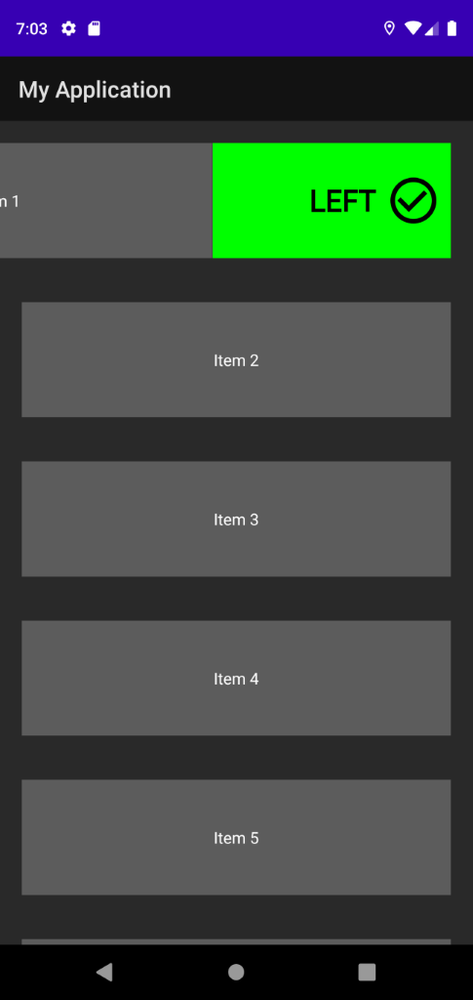

# Android-RecyclerView-Swipe-Gestures

[](https://jitpack.io/#WilliBoelke/simple-recycler-view-swipe-gestures)


## 1. Introduction 

An easy to use and highly customizable implemenation of swipe gestures for an android RecyclerView. 

* Support for left and right swipes for any RecyclerView
* Set Colours as background for each swipe direction
* Set Icons for each swipe direction 
* Sez zexzs in addition to icons

## 2. Planned 

* The Actions will be executed only when clicking on the coloured button, which will be schown when swiped, not directly after swiping. 
* More then one Action for each swipe direction (several buttons will be displayed)

## 3. Setup 

### 3.1. Add JitPack to your Project

#### Gradle: 

* Add it in your root build.gradle at the end of repositories:
```groovy
	allprojects {
		repositories {
			...
			maven { url 'https://jitpack.io' }
		}
	}
```

* Add the dependencie 
```groovy
	dependencies {
	        implementation 'com.github.WilliBoelke:simple-recycler-view-swipe-gestures:v1.1'
	}
```

#### Maven:

* Add the JitPack Repository to your pom.xml 
```xml
<repositories>
	<repository>
		<id>jitpack.io</id>
		<url>https://jitpack.io</url>
	</repository>
</repositories>
```

* Add the dependencie to your pom.xml

```xml
<dependency>
	<groupId>com.github.WilliBoelke</groupId>
	<artifactId>simple-recycler-view-swipe-gestures</artifactId>
	<version>v1.1</version>
</dependency>
```
#### Or find other versions here: 
[JitPack-SompleSwipeGestures](https://jitpack.io/#WilliBoelke/simple-recycler-view-swipe-gestures)

### 3.2 Import `SwipeGestureManager`  <br />

In your Activity add  <br />
```java 
import SwipeGestures.SwipeGestureManager;
```


## 4. Usage 

### 4.1 Implement the `SwipeCallbackLeft` and/or `SwipeCallbackLeft`:
In your activity implement the interfaces. <br />
Here you put the code which will be executed when the recyycler item was swiped.
```java
  private SwipeGestureManager.SwipeCallbackLeft leftCallback leftCallback = new SwipeCallbackLeft()
    {
        @Override
        public void onLeftSwipe(int position)
        {
            // your code here 
        }
    }; 
```

### 4.2 Initialize 'SwipeGestureManager'in your activity :  <br />

```java
 SwipeGestureManager recyclerAdapterSwipeGestures = new SwipeGestureManager(rightCallback, leftCallback);
```
If you just need one swipe gesture the just implement one of the interfaces and pass it:
 <br />
```java
SwipeGestureManager recyclerAdapterSwipeGestures = new SwipeGestureManager(rightCallback);
```


### 4.3 Set a colour:
Use the setter to set a colour: 
```java     
recyclerAdapterSwipeGestures.setBackgroundColorLeft(new ColorDrawable(Color.RED));
```
You can set a different colour for the two directions.
The standard colours are RED and GREEN.

### Colours 
Blue                          |  Yellow
:-----------------------------------:|:---------------------------------------:
       | 

### 4.4 Set Icons:
Optionally you can use icons for the swipe acions which will be displayed when the swpie is performed. 
```java
recyclerAdapterSwipeGestures.setIconRight(ContextCompat.getDrawable(this, R.drawable.your_icon));
```
That again works for both actions. 
you also can change the size of the icons by using 
```java
recyclerAdapterSwipeGestures.setIconSizeMultiplier(2);
```

Icon                                 |  
:-----------------------------------:|:---------------------------------------:
          | 
Small                                |  Small
 |  
Big                                  |  Big
     |  

###  4.5 Text 

You can set a text (insead or with and icon), the text can be customized by using the 
setters. 

```java
recyclerAdapterSwipeGestures.setTextLeft("LEFT");
recyclerAdapterSwipeGestures.setTextRight("RIGHT");
```
Customize the text : 

```java
//Set text size
recyclerAdapterSwipeGestures.setTextSize(60);

//Set text colour
recyclerAdapterSwipeGestures.setTextColor(Color.BLACK);
```
Texts can also be customized seperatly by using the setters as follows: 

```java
//Set text size
recyclerAdapterSwipeGestures.setTextSize(60, 100

//Set text colour
recyclerAdapterSwipeGestures.setTextColor(Color.BLACK, Color.YELLOW);
```


Text                              |  
:-----------------------------------:|:---------------------------------------:
Right Text                                 |  Small
 |  
Text and icon color                                   |  Only Text
     |  


### 4.6 Attach to the `RechylerViewAdapter`

You need to attach the swipe gestures to the RecyyclerView Adapter using a ItemTouchHelper
```
ItemTouchHelper itemTouchHelper = new ItemTouchHelper(recyclerAdapterSwipeGestures);
itemTouchHelper.attachToRecyclerView(recyclerView);
```


And thats it for now.
You can find an example implementation in the `MainActivity`
