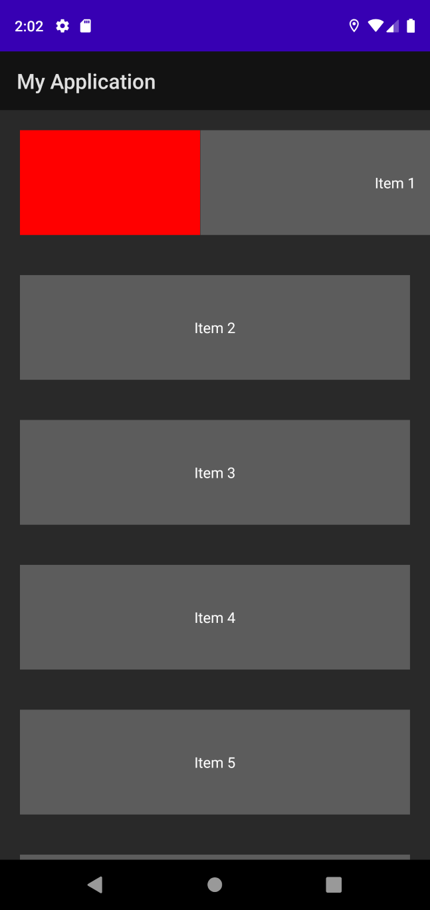
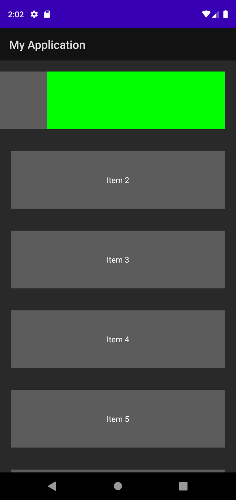
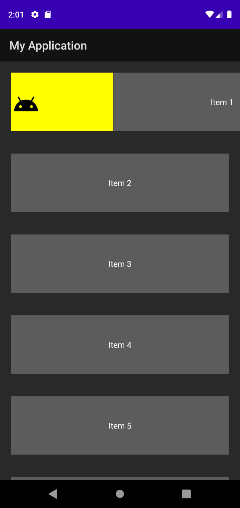
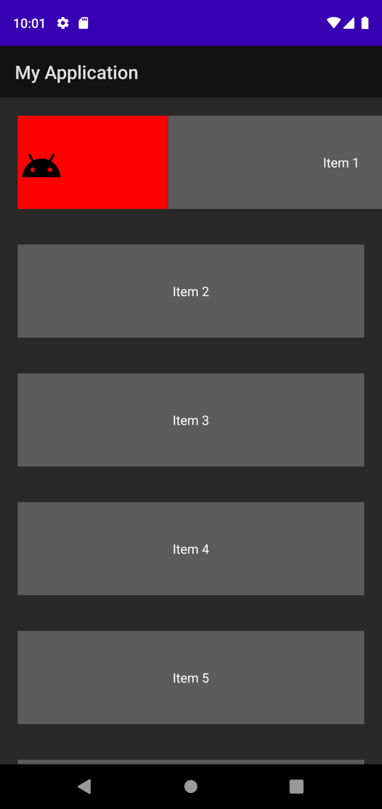
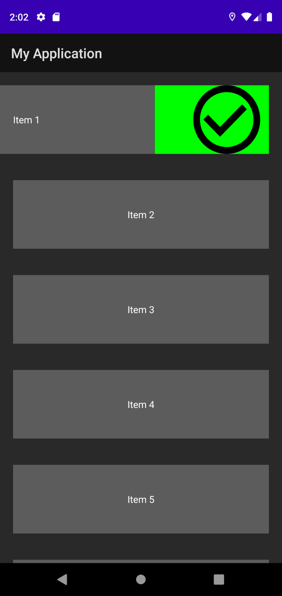

# Android-RecyclerView-Swipe-Gestures

## 1. Introduction 

An easy to use implemenation of swipe gestures for an android RecyclerView. 

* Support for left and right swipes for any RecyclerView
* Set Colours as background for each swipe direction
* Set Icons for each swipe direction 

### Showcase 
Right Swipe                         |  Left Swipe
:-----------------------------------:|:---------------------------------------:
       | 

## 2. Planned 

* The Actions will be executed onl when clicking on the coloured button, which will be schown when swiped, not directly after swiping. 
* More the Acion for each swipe direction (several buttons will be displayed)

## 3. Setup 

### 1. Copy the `SwipeGestures` package into your project structure 
### 2. Initialize 'RecyclerAdapterSwipeGestures'in your activity : 
``` 
 RecyclerAdapterSwipeGestures recyclerAdapterSwipeGestures = new RecyclerAdapterSwipeGestures(rightCallback, leftCallback);
```
If you just need one swipe gesture the just implement one of the interfaces and pass it:
```  
RecyclerAdapterSwipeGestures recyclerAdapterSwipeGestures = new RecyclerAdapterSwipeGestures(rightCallback);
```

### 3. Implement the `SwipeCallbackLeft` and/or `SwipeCallbackLeft`:
In your activity implement the interfaces which you passed in the 2. 
```  
  private SwipeCallbackLeft leftCallback = new SwipeCallbackLeft()
    {
        @Override
        public void onLeftSwipe(int position)
        {
            // your code here 
        }
    }; 
```

### 4. Set a colour:
Use the setter to set a colour: 
```     
recyclerAdapterSwipeGestures.setBackgroundColorLeft(new ColorDrawable(Color.RED));
```
You can set a different colour for the two directions.
The standard colours are RED and GREEN.

### Colours 
Blue                          |  Yellow
:-----------------------------------:|:---------------------------------------:
       | 

### 5. Set icons:
Optionally you can use icons for the swipe acions which will be displayed when the swpie is performed. 
```
recyclerAdapterSwipeGestures.setIconRight(ContextCompat.getDrawable(this, R.drawable.your_icon));
```
That again works for both actions. 
you also can change the size of the icons by using 
```
recyclerAdapterSwipeGestures.setIconSizeMultiplier(2);
```
Icons     |  Icons
:-----------------------------------:|:---------------------------------------:
       | 
Small                          |  Small  
:-----------------------------------:|:---------------------------------------:
       |  
Big      |  Big
:-----------------------------------:|:---------------------------------------:
       |  

### 6. Attach to the `RechylerViewAdapter`
You need to attach the swipe gestures to the RecyyclerView Adapter using a ItemTouchHelper
```
ItemTouchHelper itemTouchHelper = new ItemTouchHelper(recyclerAdapterSwipeGestures);
itemTouchHelper.attachToRecyclerView(recyclerView);
```

And thats it for now.
You can find an example implementation in the `MainActivity`